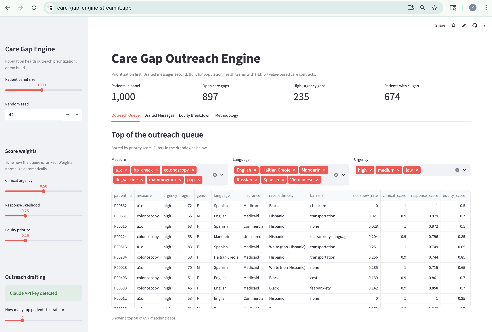

# Care Gap Outreach Engine

Population health outreach prioritization. Built for primary care teams sitting on a HEDIS or value-based care contract who can identify open care gaps but struggle to convert outreach into closed gaps.

**Live demo:** [care-gap-engine.streamlit.app](https://care-gap-engine.streamlit.app)

[](https://care-gap-engine.streamlit.app)

## The problem

Identifying care gaps is a solved problem. Every EHR-attached registry can list the patients overdue for a mammogram, a colonoscopy, an A1c. The bottleneck is converting that list into a closed gap.

Generic blast text messages convert at low single-digit rates. The outreach that actually works is personalized: in the patient's language, at the right reading level, addressing whatever specific thing has been keeping them away (transportation, cost, fear, work schedule, prior bad experience). Health systems can't write thousands of personalized messages by hand.

This tool does two things:

1. **Prioritizes the queue.** Scores every open gap on (clinical urgency × likelihood-to-respond × equity priority) so the team works the right patients first.
2. **Drafts the outreach.** Generates a personalized message per top-priority patient, language- and literacy-matched, addressing known barriers without naming them.

## What the demo shows

- A synthetic panel of 1,000 primary care patients with realistic prevalence (CDC, BRFSS), demographics (Census ACS), and insurance mix (KFF).
- Open care gaps detected against simplified USPSTF / HEDIS rules: mammography, colorectal cancer screening, cervical cancer screening, A1c, BP, flu vaccine.
- A prioritization queue ranked by a tunable score with three components: clinical urgency, response likelihood, equity priority.
- Equity breakdown comparing the top-100 queue mix vs the full panel mix, by language and insurance, so the team can see at a glance whether outreach is actively closing or widening disparities.
- Personalized outreach messages drafted by Claude, with the frozen system prompt cached so per-message cost stays roughly flat as you scale up.

## Why this matters for population health teams

For health systems on value-based care contracts, the relevant KPI is the gap closure rate, not the number of messages sent. Three things follow from that:

- **Equity-adjusted closure beats raw closure.** CMS HEDIS Health Equity Index (effective 2024+) rewards health systems that close gaps for underserved populations, not just average closure. Equity-as-a-weight-input rather than equity-as-a-quarterly-report is the right level.
- **Personalization is the lever.** Generic outreach has been studied to death; the gains from another A/B test are small. The gains from outreach that actually addresses the patient's specific barrier are large.
- **The team's time is the constraint, not the tooling.** A queue ranked by likelihood-to-close × clinical-urgency lets a small team punch above its size.

## Methodology

**Priority score** =
`w_clinical × clinical_urgency + w_response × response_likelihood + w_equity × equity_priority`

All three components normalized to [0, 1]. Defaults:

| Component | Default weight | What it measures |
|---|---|---|
| `clinical` | 0.50 | Base measure weight × urgency tier. Diabetic A1c overdue > overdue flu vaccine. |
| `response` | 0.25 | `1 - no_show_rate`. High-no-show patients need a different channel (CHW, in-person), not another text. |
| `equity` | 0.25 | Boost for Medicaid/Uninsured, non-English language, Hispanic/Black race, high-need ZIPs. |

Weights are tunable in the sidebar so a team can re-rank for the campaign they're running this week.

## Stack

- **Python + pandas** for data + scoring
- **Streamlit** for the dashboard
- **Anthropic Claude API** (`claude-opus-4-7`) for personalized outreach generation
  - Frozen system prompt with `cache_control: {type: "ephemeral"}` so cost flattens after the first call
  - Adaptive thinking - simple cases get short reasoning; multi-barrier non-English cases get more
- **Plotly** for equity breakdown charts

No PHI, no real patient data. Synthetic panel is reproducible per random seed.

## Run it

```bash
git clone https://github.com/ksolano220/care-gap-engine
cd care-gap-engine
pip install -r requirements.txt
cp .env.example .env
# add your ANTHROPIC_API_KEY to .env
streamlit run app.py
```

The dashboard works without an API key - you'll see the prioritized queue and equity breakdown - but message drafting is disabled until you set a key.

## Limitations and what would change in production

This is a portfolio demo, not a production system. A real deployment would:

- Pull from the EHR-attached registry instead of a synthetic generator (Epic Clarity / Caboodle, Cerner HealtheRegistries, etc.)
- Encode the full HEDIS / USPSTF rule set, not the six-measure subset here
- Send through the system's outreach channels (Epic MyChart messages, Twilio for SMS, IVR for older patients) rather than rendering messages on a dashboard
- Track gap closure outcomes back to the priority model and re-weight (e.g., if equity-weighted patients close at lower rates after outreach, the issue isn't outreach, it's downstream access - escalate to a CHW workflow)
- Require BAA-covered LLM hosting (Bedrock, Azure OpenAI, or self-hosted) before any real PHI flows through

The methodology card is the part that matters. Everything else is plumbing that varies by health system.

## Files

```
synthetic_data.py    Patient panel generator (CDC-grounded prevalence)
care_gaps.py         USPSTF / HEDIS rule application
prioritization.py    Scoring + ranking logic
outreach.py          Claude API integration with prompt caching
app.py               Streamlit dashboard
```
